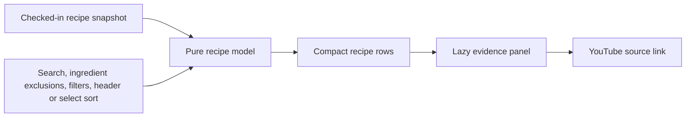

## Context

See `proposal.md` for the product-boundary motivation. The source data already
exists as a reconciled JSON snapshot containing the channel inventory, extracted
ingredients, creator-stated results, ingredient matches, estimated nutrition,
coverage, and YouTube URLs. The new repository begins without an application
stack and must stay runnable without Fleet or network services.

The relevant behavior contracts are in `specs/recipe-nutrition-ledger/spec.md`
and `specs/standalone-product-boundary/spec.md`. Root `DESIGN.md` defines the
visual system; this document defines the implementation architecture.

## Goals / Non-Goals

**Goals:**

- Keep runtime, data, application state, and automated verification entirely
  inside the standalone repository.
- Render all 264 recipe summaries quickly while creating larger evidence panels
  only when a user asks to inspect them.
- Keep search, filter, and sort behavior in a pure module that can be tested
  without a browser.
- Preserve enough provenance in the snapshot for users and checks to distinguish
  creator claims, derived estimates, missing data, and suppressed ratios.

**Non-Goals:**

- Re-scraping YouTube or recalculating USDA matches at application runtime.
- Introducing a database, account, remote API, background job, or production
  deployment.
- Treating nutrition estimates as clinical or dietary advice.

## Decisions

### Astro static creator pages

Use Astro as the only direct production dependency. Astro owns file-based page
routing, the local development server, asset bundling, and static builds. The
browser still uses small repository-owned JavaScript modules for the interactive
ledger, and Node's built-in test runner covers the pure recipe model.

The initial dependency-free server was intentionally replaced at the owner's
request. Astro is preferred over the hand-rolled server because the product now
has a generic identity and creator-specific pages; its file-based routing gives
future creators a clear extension path without introducing a client framework.

### Immutable data snapshot

Copy the reconciled recipe snapshot and pinned nutrition reference into `public/data/`.
The browser fetches only these repository-owned JSON files. Runtime logic never
imports from the old Fleet implementation and never makes a nutrition API call.

This is preferred over a filesystem link because a link would preserve the
architectural coupling that the new repository exists to remove. It is also
preferred over live scraping because live extraction would require credentials,
network reliability, rate-limit handling, and materially different specs.

### Pure recipe model plus thin DOM layer

`src/recipe-model.mjs` owns inventory selection, normalized search text,
filtering, sorting, display-value selection, and summary reconciliation.
`app.js` owns control events and accessible DOM rendering. It initially renders
compact recipe rows and lazily creates the detailed ingredient/evidence content
the first time a row is expanded.

This separation keeps nutrition and query rules testable while avoiding a
framework. Lazy detail rendering prevents hundreds of long ingredient lists
from inflating first-render cost.

### URL-backed local controls are deferred

Search and filter state remains in memory for the initial local product. The
state is visible in the controls but is not encoded into query parameters.

The primary query matches recipe titles and ingredient evidence. A separate
native dropdown exposes canonical ingredient families that actually occur in
the snapshot, including their recipe counts. Each selection becomes a removable
exclusion; a recipe is hidden when its ingredient evidence matches any selected
family. Curated families collapse source variants such as `firm tofu` and
`package firm tofu` into one useful `Soy / tofu` option without pretending that
the raw 351 source labels are clean facets.

Desktop ledger headings are buttons. Each click toggles the useful ascending
and descending order for that metric and visibly marks the active direction.
The existing sort select remains synchronized as the compact/mobile fallback.

Shareable filtered URLs were considered, but they add history and parsing
behavior that is not required for a local inspection tool. The pure model keeps
that addition straightforward later.

### Explicit product boundary checks

`scripts/check.mjs` validates the 278-record inventory, 264 visible records,
nutrition source counts, direct watch URLs, required files, and absence of
prohibited Fleet runtime or navigation terms in product files. Automated tests
exercise filter combinations, missing values, coverage gating, and sort order.

The data path is intentionally simple:

## Risks / Trade-offs

- **[Snapshot becomes stale]** → Show its capture date and source inventory in
  the interface; refresh remains an explicit future data operation.
- **[Estimated nutrition appears overly precise]** → Round display values,
  label their source, show match coverage, and suppress ratios below 80 percent.
- **[Large JSON delays first load]** → Keep the file local, render compact rows,
  and defer evidence-panel DOM creation until expansion.
- **[Astro adds transitive build packages]** → Keep Astro as the sole direct
  dependency, build statically, and rerun dependency health checks after changes.

## Migration Plan

1. Copy the two source snapshots into this repository as independent files.
2. Implement the model, Astro creator page, interface, and checks against the copied data.
3. Verify the product at 390, 768, and 1440 CSS pixels and run all local checks.
4. Leave the previous Fleet worktree unchanged for comparison; no production
   migration or rollback is required because nothing is deployed.
